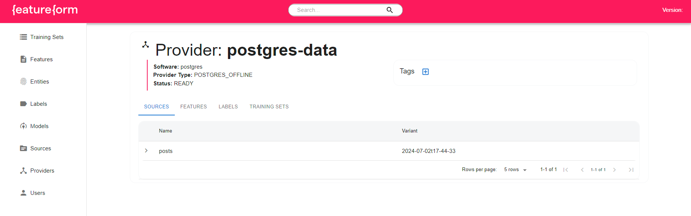
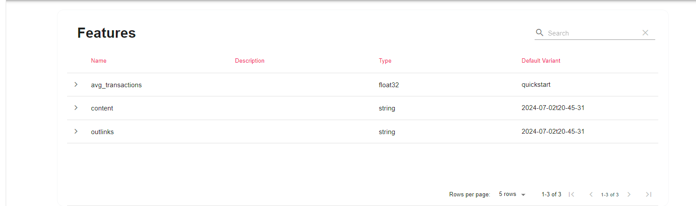
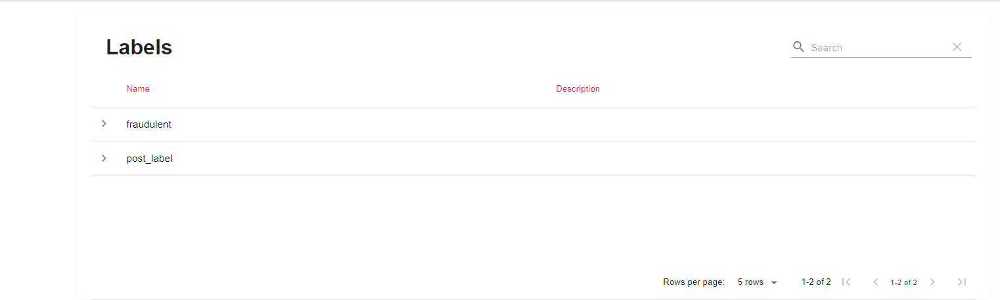
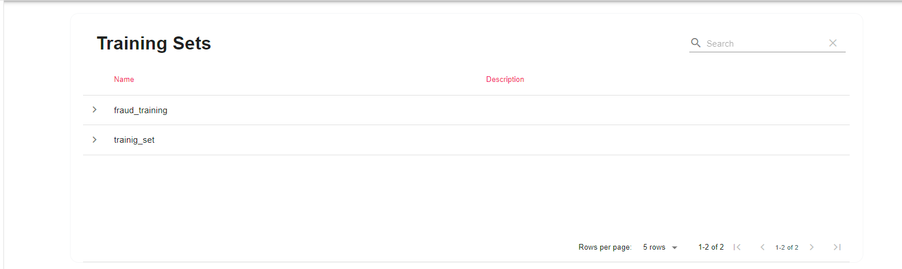

# Feast report
In this task we pull and start the Featureform container, as well as a Postgres and Redis containers containing some example data.
For example data will use data of parsing posts from telegram_channels

[Repository](https://gitlab.com/ivan_golt/featureform_repo) of feature store in Featureform.    

# Install the Featureform CLI

`poetry add featureform`

and some needef extensions:

`poetry add pandas sqlalchemy psycopg2-binary python-dotenv googleapis-common-protos`

# Start Featureform

`featureform deploy docker --quickstart`

Also you need to set the Featureform Host:

`export FEATUREFORM_HOST=localhost:7878 `

#  Apply Definitions

Featureform definitions can be stored as both a local file and URL. Multiple files can be applied at the same time.

We’ll set the --insecure flag since we’re using an unencrypted endpoint on the container.

`featureform apply quickstart/definitions.py --insecure`

# Task 

At start we push our dataset at sql storage (Postgres uses as storage)

[Code for push](https://gitlab.com/ivan_golt/featureform_repo/-/blob/main/push_to_sql.py?ref_type=heads)

Then in notebook [workflow.ipynb](https://gitlab.com/ivan_golt/featureform_repo/-/blob/main/workflow.ipynb?ref_type=heads) realized feature store in Faetureform.

Posts features: 

Posts labels:

Training set:

