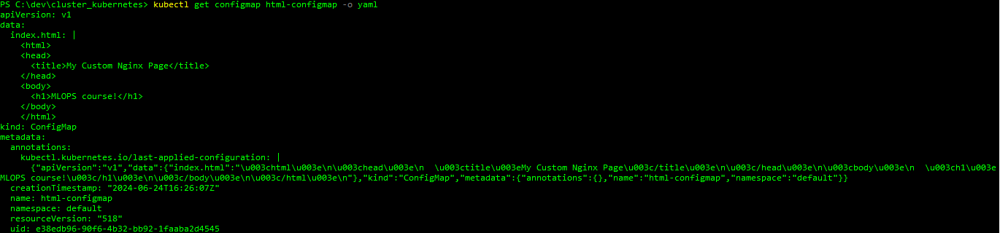
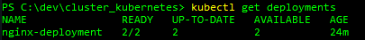
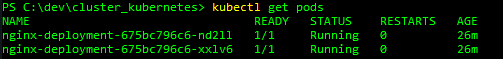
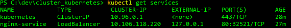
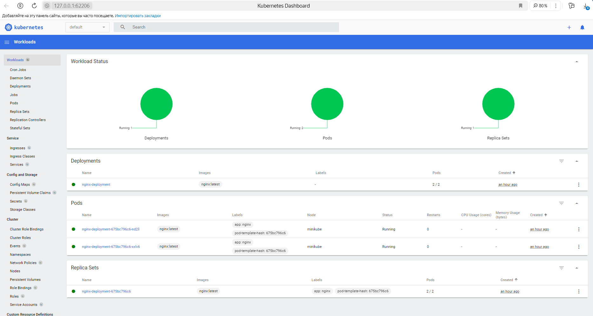

# Kubernetes report 

This task deploys a simple Kubernetes cluster on Minikube.
The cluster contains:

1) [nginx-deployment](kubernetes/nginx-deployment.yaml) - configuration of Nginx
2) [html-configmap](kubernetes/html-configmap.yaml) -  ConfigMap with your custom HTML content

# Deployment Instructions

Minikube running with docker: `minikube start --vm-driver=docker`

Deploy nginx: `kubectl apply -f nginx-deployment.yaml`

Deploy HTML web-server: `kubectl apply -f html-configmap.yaml`

Configure access to the web server from outside the cluster: `minikube ip`

Verify the Deployment and Service:

`kubectl get configmap`

`kubectl get deployments`

`kubectl get pods`

`kubectl get services`

Start Minikube Tunnel: `minikube tunnel`

Update the hosts file: To access the Nginx server using a domain name, update your hosts file (on Windows, it's located at C:\Windows\System32\drivers\etc\hosts, and on Linux, it's /etc/hosts).

`127.0.0.1 my-nginx.local`

Open this URL in browser:

Run minikube dashboard: `minikube dashboard`

